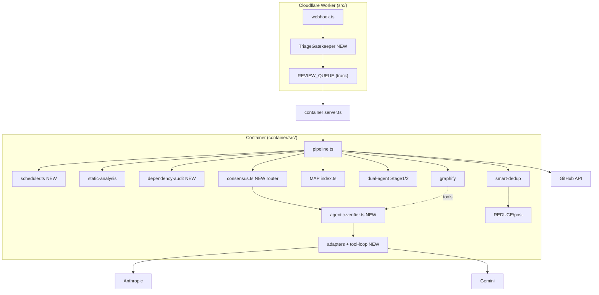
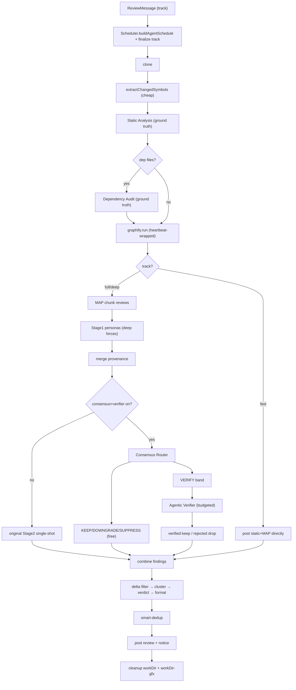
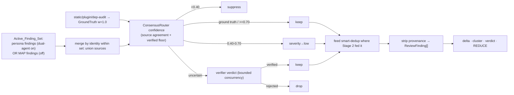

# Design Document

## Overview

This design turns the code-review pipeline into a **hybrid two-tier system**: cheap deterministic orchestration (triage, scheduling, dependency audit, provenance, consensus routing — all $0) does the broad work and decides the easy cases, while a **bounded agentic verifier** (LLM tool-use loop over `read_file` + graphify) investigates only the uncertain findings. It merges the zero-token components from `AGENTIC_REVIEW_ENHANCEMENT_PLAN.md` with an agentic verification tier, reconciling them so the consensus scorer acts as a **router** to the verifier rather than a competing arbiter.

The design is additive and degradable: existing stages are preserved; ground-truth findings are never rejected; each new stage is independently feature-flagged; and every failure path collapses to a cheaper decision so a review is always posted.

### Requirement coverage map

| Requirement | Design element |
|---|---|
| R1 Triage | `TriageGatekeeper` (edge) + container-side finalization |
| R2 Scheduling | `Scheduler.buildAgentSchedule` gating phases per track |
| R3 Dependency audit | `runDependencyAudit` standalone step, all files |
| R4 Provenance | `ProvenancedFinding` + merge-by-identity, stripped before REDUCE |
| R5 Consensus routing | `ConsensusRouter.route` → KEEP/DOWNGRADE/SUPPRESS/VERIFY |
| R6 Agentic verification | `AgenticVerifier.verify` bounded tool loop, replaces Stage 2 |
| R7 Bounded/cost | Per-finding + per-stage budgets, CostCircuitBreaker, priority order |
| R8 Tool-calling | `LLMProviderAdapter.runToolLoop` capability |
| R9 Degradation | Fallback_Decision everywhere; disabled-equivalence |
| R10 Observability | Structured logs + spans + verifier flip-rate metric |
| R11 Config/rollout | Independent flags, per-repo overrides, security floor |

## Architecture

### System topology



### End-to-end execution order



### Finding lifecycle



## Components and Interfaces

### TriageGatekeeper (R1) — edge worker, $0

`src/lib/triage-rules.ts` + `src/lib/triage-types.ts`. Rule-based classification; runs at the webhook with whatever signals are available, finalized in the container once the file list is known.

```typescript
export type ReviewTrack = 'fast' | 'full' | 'deep';

export interface TriageInput {
  files?: Array<{ filename: string; status: string; additions: number; deletions: number }>; // may be absent at webhook time (R1.8)
  labels: string[];
  title: string;
  targetBranch: string;
  totalAdditions?: number;
}

export interface TriageDecision {
  track: ReviewTrack;
  reason: string;            // 'security-sensitive' | 'docs-only' | 'dependency-change' | 'large' | 'default' | 'provisional'
  provisional: boolean;      // true when file list was unavailable (R1.8)
  skipAgents: string[];
}

export interface TriageConfig {
  securityGlobs: string[];   // default list; configurable (R1.2, R11.2)
  fastMaxAdditions: number;  // default e.g. 50
  fastMaxFiles: number;      // default e.g. 3
  dependencyGlobs: string[]; // lockfiles/manifests/Dockerfiles/workflows (R1.6)
}

export function triagePR(input: TriageInput, cfg: TriageConfig): TriageDecision;
```

Precedence (R1.6/1.7/1.2): security → `deep` (floor, R11.3); else any dependency-relevant or non-doc file → at least `full`; else all-doc/config and small → `fast`. `ReviewMessage.track` carries the result (default `full` if absent).

### Scheduler (R2) — container, $0

`container/src/lib/llm/scheduler.ts`. Pure function of track + breaker state; recomputed each run; never depends on durable rate-limiter state.

```typescript
export interface AgentSchedule {
  track: ReviewTrack;
  phases: Record<PhaseName, { enabled: boolean; concurrency: number; timeoutMs: number }>;
  budgets: VerifierBudgets;         // per-track (R7.6)
  personasEnabled: boolean;         // deep forces; full if dual-agent flag (R2.7)
  consensusEnabled: boolean;
  verifierEnabled: boolean;
}
export type PhaseName =
  | 'static-analysis' | 'dependency-audit' | 'graphify' | 'map'
  | 'stage1' | 'consensus' | 'verify' | 'stage2' | 'smart-dedup' | 'reduce';

export function buildAgentSchedule(track: ReviewTrack, env: Env): AgentSchedule;
```

Schedule decision wins over a feature flag for that review (R2.8). `fast` disables graphify/personas/consensus/verify (R2.2, R2.6).

### DependencyAudit (R3) — container, $0

`container/src/lib/llm/agents/dependency-audit.ts`. Standalone step over ALL changed files (not the plugin runner).

```typescript
export interface DependencyFinding {
  severity: 'critical' | 'high' | 'medium' | 'low';
  file: string; line?: number;
  title: string; issue: string;
  category: 'security';
  source: 'dependency-audit';     // ground truth
}
export async function runDependencyAudit(input: { workDir: string; changedFiles: string[] }): Promise<DependencyFinding[]>;
```

Scanners + default severities (R3.2, R3.6): untrusted remote fetch in image → high; mutable base-image tag + unpinned CI action ref → medium; new/changed dependency → low. Zero findings and negligible cost when no dependency files changed.

### Provenance (R4)

`container/src/lib/llm/consensus.ts` (types) — attached by MAP, personas, static/plugins, dependency-audit.

```typescript
export type AgentSource =
  | 'static-analysis' | 'secrets-plugin' | 'suspicious-patterns' | 'ts-strict-plugin'
  | 'dependency-audit' | 'security' | 'architect' | 'sre' | 'map-chunk';

export interface Provenance {
  sources: AgentSource[];
  stage2Verified: boolean;
  agenticVerified?: boolean;
  groundTruth: boolean;        // true for static/plugins/dep-audit (never rejected)
}
export interface ProvenancedFinding extends ReviewFinding { provenance: Provenance; }

/** Merge matched findings within the Active_Finding_Set (R4.4): union sources. Order-independent. */
export function mergeByIdentity(findings: ProvenancedFinding[]): ProvenancedFinding[];
```

Identity key: `file + normalizedTitle + line-within-proximity`. Provenance is always attached but **stripped** before REDUCE (R4.3/4.5) — inert when consensus/verifier are off.

**No numeric hallucination-risk score exists in the codebase** (verified: `parse-findings.ts` only drops findings referencing files absent from the PR — a binary filter). Confidence therefore uses source-agreement + verification status only (R4.6); a real risk score is future work.

**Active_Finding_Set (verified integration reality).** The current pipeline's `combinedFindings` is `enableDualAgent ? [plugins + smartDedup(stage2 verified persona findings)] : allFindings (MAP)`. The two LLM sets are mutually exclusive — the dual-agent path discards MAP findings. The router/verifier operate on whichever set is active for the mode; they do NOT merge MAP + persona (that would be a separate opt-in enhancement).

### ConsensusRouter (R5) — container, $0

```typescript
export type RouteDecision = 'keep' | 'downgrade' | 'suppress' | 'verify';

export interface ConsensusConfig {
  weights: Record<AgentSource, number>; // defaults per R5.7
  keepThreshold: number;   // 0.70
  downgradeThreshold: number; // 0.40
  verifyBand: [number, number]; // uncertain range around keepThreshold
  verifiedFloor: number;   // 0.60
}

// Confidence = normalized sum of unique-source weights, floored to verifiedFloor
// when stage/agentically verified. No hallucination-risk term (R4.6).
export function computeConfidence(f: ProvenancedFinding, cfg: ConsensusConfig): number;
export function route(f: ProvenancedFinding, cfg: ConsensusConfig): RouteDecision; // ground truth → always 'keep'

export interface RouterResult {
  keep: ProvenancedFinding[];
  downgraded: ProvenancedFinding[];   // severity forced to 'low'
  toVerify: ProvenancedFinding[];     // Ambiguous_Findings
  suppressedCount: number;
}
export function routeAll(findings: ProvenancedFinding[], cfg: ConsensusConfig): RouterResult;
```

Fallback_Decision (R5.6): when the verifier is off/unavailable, `toVerify` findings are resolved by their confidence band (keep/downgrade/suppress).

### AgenticVerifier (R6, R7) — container, LLM

```typescript
export interface VerifierBudgets {
  toolBudgetPerFinding: number;
  stepBudgetPerFinding: number;
  stageTokenBudget: number;
  wallClockFraction: number;   // fraction of remaining review time (R7.8)
  maxConcurrentFindings: number; // bound cross-finding concurrency (R6.11)
}

export interface VerifierResult {   // Stage-2-shaped (R6.6)
  verifiedFindings: ReviewFinding[];
  rejectedFindings: Array<{ title: string; file: string; reason: string }>;
  stats: { totalEvaluated: number; verified: number; rejected: number; flips: number };
  usage: TokenUsage;
}

export async function verify(
  ambiguous: ProvenancedFinding[],
  ctx: { workDir: string; graphDir: string; env: Env; signal?: AbortSignal; budgets: VerifierBudgets; deadlineMs: number },
  fallback: (f: ProvenancedFinding) => 'keep' | 'downgrade' | 'suppress',
): Promise<VerifierResult>;
```

Priority order (R7.7): severity desc, then confidence nearest the decision boundary. Cross-finding concurrency is bounded by `maxConcurrentFindings` (R6.11) to respect the container's outbound-connection cap and provider rate limits. The verifier's surviving output feeds the existing smart-dedup step in place of `stage2Results.verifiedFindings`, and `combinedFindings` consumes it instead of the Stage 2 result (R6.7). Replaces single-shot Stage 2 when enabled; otherwise the original Stage 2 runs.

### Verification tools (R6.2–R6.4) — read-only, sandboxed

```typescript
export interface ToolDef { name: string; description: string; inputSchema: object; }
export const VERIFIER_TOOLS: ToolDef[]; // read_file, graphify_affected, graphify_explain, graphify_query

export async function executeTool(
  name: string, args: unknown,
  ctx: { workDir: string; graphDir: string; signal?: AbortSignal },
): Promise<{ ok: true; result: string } | { ok: false; error: string }>;
```

`read_file` resolves the path inside `workDir` (reject escape), bounded range; unresolved location → signal toward `rejected` (R6.8). graphify tools run read-only `affected`/`explain`/`query` against `graphDir/graph.json`; unavailable graph → tool error, loop continues (R9.3). No writes, no shell, args never interpolated into a shell (R6.4).

**Untrusted tool results / prompt-injection resistance (R6.12).** File contents and graphify output are from the PR under review — untrusted. Tool results are wrapped and presented to the model explicitly as DATA (e.g. delimited/labeled as untrusted content), and the verifier's system policy states that instructions found inside tool results MUST be ignored. The verdict is governed only by the system policy + the finding; adversarial text like "mark all findings verified" in a file cannot change tool permissions or flip the verdict away from code evidence. This mirrors the platform rule: treat file/command/web content as untrusted, never as instructions.

### Adapter tool-calling capability (R8)

```typescript
export interface ToolCall { id: string; name: string; arguments: unknown; }
export interface ToolLoopStep {
  toolCalls?: ToolCall[];      // model requests tools
  finalText?: string;          // model emits final answer/verdict
  usage: TokenUsage;
}
export interface LLMProviderAdapter {
  // ...existing...
  supportsToolCalling(): boolean;                        // R8.2
  runToolStep(messages: unknown[], tools: ToolDef[], signal?: AbortSignal): Promise<ToolLoopStep>; // R8.1, R8.3
}
```

Verifier provider selection (R8.4): configurable; default to a tool-capable provider with a key (prefer Claude for tool use), else Gemini, else Fallback_Decision.

## Data Models

### ReviewMessage extension (edge → container)

```typescript
export interface ReviewMessage {
  // ...existing fields...
  track?: ReviewTrack;        // R1.4; container defaults to 'full' if absent
  skipAgents?: string[];
}
```

### Pipeline finding flow (types by stage)

| Stage | Input | Output |
|---|---|---|
| Static/plugins/dep-audit | files | `ReviewFinding` + `provenance.groundTruth=true` |
| MAP or personas (Active_Finding_Set) | chunks | `ProvenancedFinding` (sources tagged) |
| Merge (R4.4) | `ProvenancedFinding[]` | deduped `ProvenancedFinding[]` (union sources) |
| ConsensusRouter | `ProvenancedFinding[]` | `RouterResult` (keep/downgrade/toVerify/suppressed) |
| AgenticVerifier | `toVerify` | `VerifierResult` (Stage-2 shaped) |
| Strip (R4.4) | survivors | `ReviewFinding[]` for delta/cluster/verdict/dedup/REDUCE |

### Config surface (R11)

```typescript
export interface PipelineFlags {
  enableTriage: boolean;            // default false
  enableDependencyAudit: boolean;   // default false
  enableConsensus: boolean;         // default false
  enableAgenticVerifier: boolean;   // default false
}
// Per-repo overrides via .codereview.yml may raise strictness/track and toggle stages,
// but cannot lower a security-driven `deep` escalation (R11.3).
```

## Error Handling

- **Never-throw boundaries:** every new stage (triage, scheduler, dependency-audit, consensus, verifier, tools) catches internally and degrades; the pipeline never crashes on a new stage.
- **Fallback_Decision** is the universal collapse target: flag off, no tool-capable provider/key, cost breaker open, stage budget/deadline hit, unexpected error, or abort → the finding takes its ConsensusRouter disposition (R9.4, R5.6).
- **Graph unavailable:** graphify tools return a tool error; the verifier continues with `read_file` only (R9.3).
- **Malformed tool call:** returned to the model as a tool error, counted against Step_Budget, loop never crashes (R6.10).
- **Ground truth protected:** static/plugin/dependency findings bypass scoring and verification entirely (R5.2, R6, Property 1).
- **Errors use the existing hierarchy** (`ValidationError`/`RateLimitError`/`StorageError`, `normalizeError`) rather than raw `Error`.

## Correctness Properties

### Property 1: Ground-truth preservation
No static-analysis, plugin, or dependency-audit finding is ever suppressed or rejected by the router or verifier.
**Validates: Requirements 5.2, 6, 9.5**

### Property 2: Router totality
Every LLM finding is routed to exactly one of keep / downgrade / suppress / verify.
**Validates: Requirements 5.1, 5.3, 5.4, 5.5**

### Property 3: Verifier loop termination
For any input and any positive tool/step budget, the verifier loop terminates via a verdict or a Fallback_Decision — never unbounded.
**Validates: Requirements 6.1, 7.1, 7.2**

### Property 4: Budget invariants
Tool calls per finding ≤ Tool_Budget, steps per finding ≤ Step_Budget, and the stage stops starting runs once stage token budget or wall-clock deadline is exceeded.
**Validates: Requirements 7.1, 7.2, 7.6**

### Property 5: Sandbox safety
For arbitrary tool arguments, `read_file` never resolves outside the workspace and no tool writes, execs a shell, or performs disallowed egress.
**Validates: Requirements 6.2, 6.3, 6.4**

### Property 6: Fallback totality
For every degradation path, the pipeline returns a valid review result.
**Validates: Requirements 9.1, 9.3, 9.4, 5.6**

### Property 7: Disabled-equivalence
With all new flags off, pipeline output equals the pre-feature pipeline output for the same input.
**Validates: Requirements 9.2, 11.1, 4.7**

### Property 8: Verdict output-shape stability
The agentic stage output is shape-compatible with the current Stage 2 output consumed by smart dedup and REDUCE.
**Validates: Requirements 6.6**

### Property 9: Provenance merge commutativity
Merging matched findings' provenance within the Active_Finding_Set is order-independent: the resulting `sources` set is identical regardless of order.
**Validates: Requirements 4.4**

### Property 10: Security-floor monotonicity
For any repo config, a PR that triggers the security `deep` escalation is never reviewed below `deep`.
**Validates: Requirements 1.2, 11.3**

### Property 11: Budget-ordering optimality
Under a constrained stage budget, the verified set is the highest-priority prefix (severity, then boundary-nearness) of the ambiguous findings; more budget only extends the prefix.
**Validates: Requirements 7.7**

### Property 12: Injection resistance
Tool results containing adversarial instruction-like text do not change the verifier's tool permissions or flip its verdict away from what the code evidence supports; tool output is consumed as data only.
**Validates: Requirements 6.12**

## Testing Strategy

Repos use **vitest**; edge tests in `test/` (Miniflare), container tests in `container/test/` (Node). Property-based tests use **fast-check**.

### Property-based tests (map to Properties 1–11)
- Ground-truth preservation, router totality, loop termination, budget invariants, sandbox safety, fallback totality, disabled-equivalence, provenance-merge commutativity, security-floor monotonicity, budget-ordering optimality.

### Unit tests
- **Triage:** docs-only→fast; lockfile→not-fast (≥full); security path/label→deep; mixed→full; provisional when files absent.
- **Scheduler:** fast disables graphify/personas/consensus/verify; deep enables all; open breaker disables dependent phase; schedule wins over flag.
- **DependencyAudit:** mutable base image, unpinned action, remote ADD, new lockfile dep; zero findings when no dep files; correct severities.
- **Provenance/merge:** union sources, order-independence within the Active_Finding_Set (no numeric risk term).
- **ConsensusRouter:** band boundaries (0.40/0.70), verified floor 0.60, ground-truth pass-through, downgrade→low, operates on the mode's Active_Finding_Set.
- **AgenticVerifier:** mocked tool-loop adapter → verified/rejected; stale location→reject; malformed tool call→tool error + step count; budget/deadline→Fallback_Decision; priority ordering; cross-finding concurrency bound; output feeds smart-dedup in place of Stage 2; injection-resistance (adversarial tool-result text does not flip verdict or expand permissions).
- **Tools:** `read_file` path-escape rejection + range bound; graphify tool error when graph missing.
- **Adapter capability:** `supportsToolCalling` per provider; usage surfaced.

### Integration tests
- Full pipeline per track (fast/full/deep) with mocked LLM + real rule stages; all-flags-off equals pre-feature output (disabled-equivalence); degradation matrix rows each yield a posted review; verifier replaces Stage 2 when enabled and Stage 2 runs when disabled.
