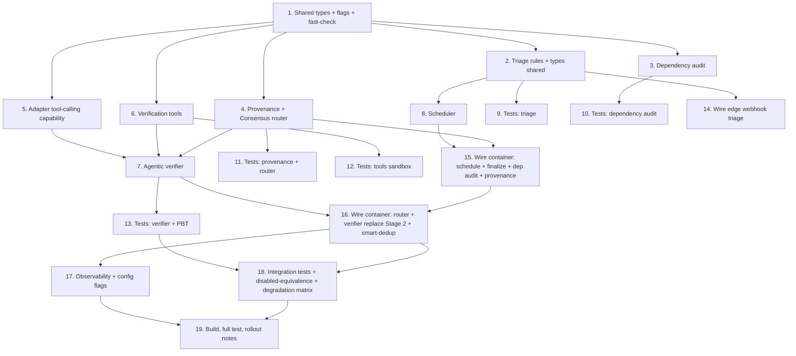

# Implementation Plan

## Overview

Implements the hybrid two-tier review pipeline: cheap deterministic stages (triage, scheduler, dependency audit, provenance, consensus router) plus a bounded agentic verifier, all independently feature-flagged and degradable. Foundation types first, then the independent components in parallel, then the agentic verifier and scheduler, then per-component tests, then the pipeline wiring (edge + container) that replaces single-shot Stage 2, and finally observability and rollout. Every new stage defaults OFF so the pipeline is inert until enabled.

## Task Dependency Graph



```json
{
  "waves": [
    { "wave": 1, "tasks": ["1"] },
    { "wave": 2, "tasks": ["2", "3", "4", "5", "6"] },
    { "wave": 3, "tasks": ["7", "8"] },
    { "wave": 4, "tasks": ["9", "10", "11", "12", "13"] },
    { "wave": 5, "tasks": ["14", "15", "16"] },
    { "wave": 6, "tasks": ["17", "18"] },
    { "wave": 7, "tasks": ["19"] }
  ]
}
```

## Tasks

- [x] 1. Foundation: shared types, feature flags, test tooling
  - Add `PipelineFlags` (enableTriage, enableDependencyAudit, enableConsensus, enableAgenticVerifier — all default false) and `ReviewTrack` to config; add `track?`/`skipAgents?` to `ReviewMessage` in `src/types/env.ts` (and the container mirror).
  - Add tunable constants (weights, thresholds, per-track budgets) to `container/src/config/constants.ts`.
  - Ensure `fast-check` is available for property tests in both `test/` and `container/test/`.
  - _Requirements: 8, 11.1, 11.2_

- [x] 2. Triage rules + types (shared edge/container)
  - Create `src/lib/triage-types.ts` and `src/lib/triage-rules.ts` with `triagePR(input, cfg): TriageDecision` implementing precedence: security→deep (floor), dependency/non-doc→≥full, all-doc+small→fast, provisional when files absent.
  - Make the module importable by the container (shared or duplicated-in-sync copy) for finalization.
  - _Requirements: 1.1, 1.2, 1.3, 1.6, 1.7, 1.8, 1.9_

- [x] 3. Dependency audit
  - Create `container/src/lib/llm/agents/dependency-audit.ts` with `runDependencyAudit({workDir, changedFiles})` scanning lockfiles, package manifests, Dockerfiles, and CI workflows; emit ground-truth `DependencyFinding[]` with fixed per-rule severities; zero findings + negligible cost when no dep files changed.
  - _Requirements: 3.1, 3.2, 3.3, 3.4, 3.5, 3.6_

- [x] 4. Provenance types + Consensus router
  - Create `container/src/lib/llm/consensus.ts`: `Provenance`/`ProvenancedFinding`, `mergeByIdentity` (union sources within a set), `computeConfidence` (source-weight agreement + verified floor; NO hallucination term), `routeAll` → keep/downgrade/suppress/toVerify. Ground-truth findings bypass scoring.
  - _Requirements: 4.1, 4.2, 4.3, 4.4, 4.6, 5.1, 5.1a, 5.2, 5.3, 5.4, 5.5, 5.7, 5.8_

- [x] 5. Adapter tool-calling capability
  - Extend `LLMProviderAdapter` (`adapter.ts`) with `supportsToolCalling()` and `runToolStep(messages, tools, signal)`; implement for Claude and Gemini adapters; report unavailable where unsupported; surface per-step token usage.
  - _Requirements: 8.1, 8.2, 8.3_

- [x] 6. Verification tools (read-only, sandboxed)
  - Create the tool layer: `read_file` (workspace-bounded range, reject path escape, stale-location signal), `graphify_affected`/`explain`/`query` (read-only against `graphDir/graph.json`, tool-error when unavailable). No writes/shell/egress; args never shell-interpolated. Export `VERIFIER_TOOLS` + `executeTool`.
  - _Requirements: 6.2, 6.3, 6.4, 9.3_

- [x] 7. Agentic verifier
  - Create `container/src/lib/llm/agentic-verifier.ts` with `verify(ambiguous, ctx, fallback)`: bounded tool loop per finding (tool/step budgets → force verdict/fallback), stage token budget + wall-clock deadline (fraction of remaining time), priority order (severity then boundary-nearness), bounded cross-finding concurrency, cost-breaker gating, abort handling, provider selection (prefer tool-capable). Stale location→reject; malformed tool call→tool error + step count. Present tool results as UNTRUSTED DATA with a system policy that ignores embedded instructions (prompt-injection resistance). Output Stage-2-shaped `VerifierResult` and record usage in `llmCalls`.
  - _Requirements: 6.1, 6.5, 6.6, 6.8, 6.9, 6.10, 6.11, 6.12, 6.13, 7.1, 7.2, 7.3, 7.4, 7.5, 7.6, 7.7, 7.8, 8.4_

- [x] 8. Scheduler
  - Create `container/src/lib/llm/scheduler.ts` `buildAgentSchedule(track, env)`: per-track phase enablement (fast skips graphify/personas/consensus/verify; deep forces personas + largest budgets), breaker-aware disabling, schedule-wins-over-flag, fresh each run.
  - Add the 3 new circuit breakers (triage, dependency-audit, consensus) to `retry.ts`.
  - _Requirements: 2.1, 2.2, 2.3, 2.4, 2.5, 2.7, 2.8_

- [x] 9. Tests: triage
  - Unit + property tests for `triagePR`: docs-only→fast; lockfile→≥full; security path/label→deep; mixed→full; provisional when files absent; security-floor monotonicity.
  - _Requirements: 1.1, 1.2, 1.3, 1.6, 1.7, 1.8_

- [x] 10. Tests: dependency audit
  - Unit tests: mutable base image, unpinned action, remote ADD, new lockfile dep, zero findings when none, correct severities.
  - _Requirements: 3.2, 3.3, 3.6_

- [x] 11. Tests: provenance + consensus router
  - Property: merge commutativity (union sources, order-independent); router totality (exactly one route). Unit: band boundaries 0.40/0.70, verified floor 0.60, ground-truth pass-through, downgrade→low, operates on active set.
  - _Requirements: 4.4, 5.1, 5.2, 5.3, 5.4, 5.5_

- [x] 12. Tests: verification tools sandbox
  - Property: `read_file` never resolves outside workspace for arbitrary args; no tool writes/execs. Unit: range bound, stale location error, graphify tool-error when graph missing.
  - _Requirements: 6.2, 6.3, 6.4, 9.3_

- [x] 13. Tests: agentic verifier + PBT
  - Mock tool-loop adapter: verified/rejected verdicts; loop termination (Property), budget invariants (Property), fallback totality per degradation reason (Property), priority ordering (Property), output-shape stability (Property), concurrency bound, injection-resistance (adversarial tool-result text does not flip verdict/permissions).
  - _Requirements: 6.1, 6.5, 6.6, 6.8, 6.9, 6.10, 6.11, 6.12, 7.1, 7.2, 7.3, 7.5, 7.7_

- [x] 14. Wire edge webhook triage
  - In `src/handlers/webhook.ts`, call `triagePR` (provisional if file list absent), attach `track` to the `ReviewMessage`; gate on `enableTriage` (default full when off).
  - _Requirements: 1.4, 1.5, 1.8, 11.1_

- [x] 15. Wire container: schedule, finalize track, dependency audit, provenance tagging
  - In `pipeline.ts`: build the Agent_Schedule, finalize the track once files are known, run dependency audit (ground truth), and tag MAP + persona findings with Provenance. Fast track posts static+MAP directly.
  - _Requirements: 2.1, 2.6, 3.1, 4.1, 4.5, 9.5_

- [x] 16. Wire container: consensus router + verifier replacing Stage 2
  - Insert the Consensus_Router on the Active_Finding_Set; route VERIFY findings to the Agentic_Verifier when enabled (else Fallback_Decision / original Stage 2); feed surviving findings into smart-dedup exactly where Stage 2's verified findings feed it, and update `combinedFindings` to consume the verifier output. Wrap the verifier stage in the CheckRun heartbeat.
  - _Requirements: 5.6, 6.7, 7.4, 9.1, 9.4_

- [x] 17. Observability + config flags
  - Emit logs + tracer spans for triage, schedule, dependency audit, consensus routing (route counts), and verifier (per-finding steps/tools/verdict; aggregate stats; flip-rate metric). Wire per-repo `.codereview.yml` overrides (cannot lower security floor).
  - _Requirements: 10.1, 10.2, 10.3, 10.4, 10.5, 10.6, 10.7, 11.3_

- [x] 18. Integration tests: disabled-equivalence + degradation matrix
  - Per-track pipeline runs (fast/full/deep) with mocked LLM; all-flags-off equals pre-feature output (disabled-equivalence Property); each degradation row yields a posted review; verifier replaces Stage 2 when on, Stage 2 runs when off.
  - _Requirements: 9.1, 9.2, 9.3, 9.4, 11.1_

- [x] 19. Build, full test, and rollout notes
  - Run `npm run build` + full `vitest` in both `src/` and `container/`; fix failures; re-run `wrangler types` if bindings changed. Document the staged rollout (enable flags one track/stage at a time) and the deferred §12 items.
  - _Requirements: 10, 11.2, 11.4_

## Notes

- Commands: edge `npm test` / `npm run build`; container `npm test --prefix container` / `npm run build --prefix container`.
- All new stages default OFF; disabled-equivalence must hold at every step.
- Ground-truth findings (static/plugins/dependency-audit) are never scored or rejected.
- The router/verifier operate on the mode's Active_Finding_Set (persona when dual-agent on, MAP when off) — no MAP+persona merge in this spec.
- No numeric hallucination-risk score is introduced; confidence is source-agreement + verification only.
- Deferred (out of scope): dismissed-finding feedback loop, inline `// codereview-ignore` pragmas, AI-vs-human differentiation, checkpoint/restart (AGENTIC_REVIEW_ENHANCEMENT_PLAN.md §12).
