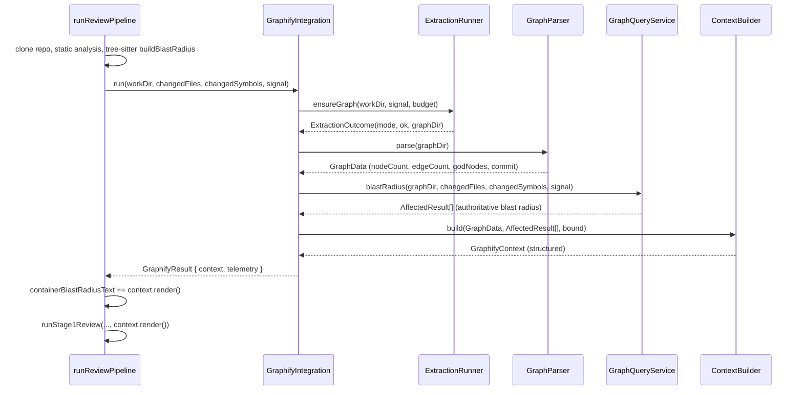

# Design Document

## Overview

This design replaces the monolithic, decorative `runGraphifyIndexing()` in `container/src/pipeline.ts` with a small set of focused components that turn the graphify knowledge graph into a first-class, PR-scoped input to the review. The redesign fixes the schema-mismatch bugs (edges/god-nodes/commit always blank), adds PR-scoped querying via graphify's reverse-traversal commands, prefers incremental extraction, degrades gracefully so no graph failure can empty a review, and emits structured observability.

The public contract with the rest of the pipeline is preserved: the two existing prompt-injection points (map-phase `containerBlastRadiusText` → `buildReviewChunks`, and dual-agent `graphifyContext` → `runStage1Review`) continue to receive a valid string.

### Requirement coverage map

| Requirement | Design element |
|---|---|
| R1 Correct parsing | `GraphParser` reads `links`, sidecar `gods` (else derives gods from link-degree), `built_at_commit`, node `.label` into typed `GraphData` |
| R2 PR-scoped querying | `GraphQueryService` maps changed files → unique node IDs → `graphify affected` |
| R3 Incremental extraction | `ExtractionRunner`: default `graphify update` (code-only, no key, docs-safe, in-repo); `graphify extract --out --backend` only on semantic opt-in, budget-bounded |
| R4 Graceful degradation | Failure matrix in `GraphifyIntegration`; `ContextBuilder` totality |
| R5 Observability | Structured `logger` fields + tracer span attributes |
| R6 Backward-compatible injection | `GraphifyContext` structured model + `render()` to string at both points |
| R7 Bounded context | `ContextBuilder` pure, char-bounded with priority truncation |
| R8 Tree-sitter relationship | cheap `extractChangedSymbols` always; expensive `buildBlastRadius` only as graphify-unavailable fallback |
| R9 Headless invocation | `ExtractionRunner` uses `graphify extract`/`update`; queries use explicit `--graph` path |
| R10 Native PR-impact | Decision recorded: decline `graphify prs`; equivalent via `affected`-by-ID |
| R11 Direction + confidence | Direction from `affected` output; confidence optional via targeted `explain` |
| R12 Failure notice | `GraphifyContext.reviewNotice()` appended to the posted review |

## Architecture

### Component decomposition

The single `runGraphifyIndexing` function is split into five components plus a thin orchestrator, all under a new module `container/src/lib/graphify/`:

```
container/src/lib/graphify/
  index.ts            # GraphifyIntegration orchestrator (public entry)
  extraction-runner.ts# ExtractionRunner: run/update graphify CLI
  graph-parser.ts     # GraphParser: graph.json + sidecar → GraphData
  query-service.ts    # GraphQueryService: affected/query/explain
  context-builder.ts  # ContextBuilder: GraphData + queries → GraphifyContext (pure)
  types.ts            # GraphData, GodNode, AffectedResult, GraphifyContext
```

`GraphifyIntegration.run()` is the sole entry point called from `pipeline.ts`, replacing `runGraphifyIndexing`. It returns a structured result whose `.render()` produces the string consumed at both injection points.

### Placement in the pipeline



`GraphifyIntegration.run()` is invoked at the same point the current `runGraphifyIndexing` is called — after static analysis and after `buildBlastRadius`, so the tree-sitter `changedSymbols` are available as query seeds and as the R8 fallback.

## Data Models

New file `container/src/lib/graphify/types.ts`:

```typescript
/** A highly-connected node from .graphify_analysis.json → gods[] */
export interface GodNode {
  id: string;
  label: string;
  degree: number;
}

/** Raw networkx node-link node shape we rely on (others ignored). */
interface RawGraphNode {
  id: string;
  label?: string;
  source_file?: string;
}

/** Typed, safe representation parsed from graph.json + sidecar. */
export interface GraphData {
  nodeCount: number;        // nodes.length
  edgeCount: number;        // links.length  (R1.1 — was wrongly reading `edges`)
  godNodes: GodNode[];      // sidecar gods[] (R1.4 — was wrongly reading graph.json.godNodes)
  builtAtCommit?: string;   // built_at_commit (R1.5)
  /** id/label → source_file index, for mapping changed files to symbols. */
  nodesByFile: Map<string, RawGraphNode[]>;
  available: boolean;       // false when graph.json missing/malformed (R4.2)
}

/** Result of one reverse-traversal query for a changed node. */
export interface AffectedResult {
  subject: string;          // unique node ID queried (not a bare label)
  matchCount: number;       // R5.2
  dependents: Array<{
    label: string;
    relation: string;                              // calls | imports | references | ...
    location?: string;
    confidence?: 'EXTRACTED' | 'INFERRED' | 'AMBIGUOUS'; // R11.2
  }>;
}

/** Extraction outcome for observability + control flow. */
export interface ExtractionOutcome {
  ok: boolean;
  mode: 'full' | 'incremental' | 'none';
  graphDir: string;
  durationMs: number;
  degradationReason?: DegradationReason;
}

export type DegradationReason =
  | 'missing-key'      // docs need semantic key
  | 'timeout'          // exceeded budget / aborted
  | 'malformed-graph'  // graph.json unreadable/invalid
  | 'unexpected-error';

/** Structured context (R6.4 allows structured data); render() → string. */
export interface GraphifyContext {
  readonly available: boolean;
  readonly degradationReason?: DegradationReason;
  /** Pure serialization to the string both injection points consume. */
  render(): string;
  /**
   * Concise human-readable notice for the POSTED review when degraded (R12).
   * Returns undefined when extraction + querying fully succeeded, so no notice
   * is added on the happy path (R12.3).
   */
  reviewNotice(): string | undefined;
}
```

The `GraphifyResult` returned to the pipeline bundles the context with telemetry:

```typescript
export interface GraphifyResult {
  context: GraphifyContext;
  telemetry: {
    nodeCount: number; edgeCount: number; godNodeCount: number;
    mode: ExtractionOutcome['mode']; durationMs: number;
    queriedSymbols: number; totalMatches: number;
    degradationReason?: DegradationReason;
  };
}
```

## Components and Interfaces

### GraphParser (R1, R4, Property 1 — never throws)

`parse(graphDir): GraphData` reads `graphDir/graph.json` and `graphDir/.graphify_analysis.json`. Every field access is defensive:

- `edgeCount = Array.isArray(json.links) ? json.links.length : 0` (R1.1).
- `nodeCount` from `json.nodes` length (R1.2); build `nodesByFile` from each node's `source_file` and `label` (R1.3).
- `godNodes`: read sidecar `gods`, coerce each entry to `{id,label,degree}`, skipping malformed entries. WHEN the sidecar is absent/unreadable (the code-only `update` path emits none), DERIVE god nodes deterministically from the graph's own `links` (undirected degree = count of links touching a node; top-N by degree, tie-broken by node id). Sidecar values, when present, take precedence (R1.4, R1.6). Derivation keeps the god-node signal alive on the default path without an extra subprocess and stays pure/deterministic.
- `builtAtCommit` from `built_at_commit` if a string (R1.5).
- Any read/parse exception → return `{ available:false, nodeCount:0, edgeCount:0, godNodes:[], nodesByFile:new Map() }` (R4.2, Property 1). The parser catches internally and never throws.

Only keys known to exist in graphify 0.9.5 are read (R1.7).

### ExtractionRunner (R3)

`ensureGraph(workDir, signal, budgetMs): Promise<ExtractionOutcome>`:

**⚠️ Corrected after CLI verification (0.9.5).** An earlier revision of this design chose `graphify extract` for the default path and rejected `graphify update`. Running the pinned binary disproved that: **`graphify extract` HARD-FAILS (exit 1, writes NO `graph.json`) whenever the repo contains any doc/paper/image file and no LLM key is set** — i.e. nearly every real repo, since they all have a README. There is no `--code-only`/skip-docs flag on `extract`. `graphify update`, by contrast, is the documented headless **no-LLM, code-only** command and produces a graph even with docs present and no key. So the command roles are swapped from the earlier draft:

0. **Command selection by backend policy.**
   - **DEFAULT (code-only, no key) → `graphify update <workDir>`.** Verified to succeed (exit 0) with docs present and no key. It writes **in-repo** to `<workDir>/graphify-out` (it does **not** accept `--out`). Before running, delete any pre-existing `<workDir>/graphify-out` so we never `update` against a committed/stale/foreign graph and always build a clean graph for THIS clone (R3.8b). The clone is a throwaway sandbox removed wholesale in pipeline cleanup, so the in-repo output is cleaned automatically. `mode` is always `full` (the incremental cache lived in the graphify-out we removed for safety). NOTE: `update` writes **no** `.graphify_analysis.json` sidecar → the GraphParser derives god nodes from the graph's own `links` (see below).
   - **SEMANTIC OPT-IN (`GRAPHIFY_SEMANTIC_DOCS=1` AND a key present) → `graphify extract <workDir> --out <outParent> --backend <b>`** where `outParent = <workDir>-gfx`. VERIFIED: `extract --out <dir>` writes to `<dir>/graphify-out/graph.json`, so `graphDir = join(outParent, 'graphify-out')`. This is the only path that semantically extracts docs and the only path that emits the sidecar. It accepts `--out`, so it writes OUTSIDE the repo (collision-safe). `mode` is `incremental` when a prior (our own) out-of-repo graph exists, else `full` (telemetry only; command unchanged). `extract` produces no HTML and accepts no `--no-viz`/`--directed`. If it still exits with "no LLM API key found", any code-only graph written is salvaged (`missing-key`).
1. **Existence check** (R3.7): applies to the semantic path (`<workDir>-gfx/graphify-out/graph.json`, our own out-of-repo location) to pick the `incremental`/`full` telemetry label.
2. Both commands are the documented **headless** forms (R3.2, R9.1), never the interactive `graphify .` skill. Directionality is obtained at query time from `affected`'s reverse traversal (R11.1).
3. **Code-only by default; semantic docs are opt-in (R3.8, R9.2).** The default (`update`) is fully offline, deterministic, free, and independent of container egress — and, crucially, cannot hard-fail on docs. Verified risks that also drive keeping semantic extraction opt-in: (a) the container uses a host-scoped outbound model, so graphify calling the Gemini endpoint directly may be blocked and hang until the Time_Budget expires; (b) graphify's semantic-extraction token spend is **outside** the app's cost circuit breaker / usage tracking. Semantic extraction is enabled ONLY when `GRAPHIFY_SEMANTIC_DOCS=1` AND a key is present. An opt-in **without** a key falls back to the code-only `update` path (never a docs-failing `extract`), consistent with R9.3.
4. Run via `execa(cmd, args, { cwd: workDir, timeout: budgetMs, cancelSignal: signal, reject: false })`.
5. On exit 0 within budget → `ok:true`, record `mode` and `durationMs`; the caller uses this graph immediately (R3.6).
6. On non-zero exit whose stderr matches the "no LLM API key found" pattern → `ok` reflects whether a code-only `graph.json` was still written; degradation `missing-key` (R4.1). We keep any code-only graph produced.
7. On timeout/abort → `mode` recorded, `degradationReason:'timeout'`; caller falls back (R3.4).
8. A dedicated 30s `setInterval` heartbeat wraps the `graphifyIntegration.run(...)` call in `pipeline.ts`, re-posting the "🗺️ Indexing…" CheckRun progress so the review never appears stalled during the up-to-`GRAPHIFY_BUDGET_MS` extraction window; it is `clearInterval`-ed in a `finally`. Extraction runs as a child process, so the event loop stays free to fire it (R3.5).

**Version pinning (R3.10, R9).** The `Dockerfile` currently runs `pip3 install --break-system-packages graphifyy` unpinned; latest PyPI is on the 0.9.x line while the parser is verified against the 0.9.5 node-link schema. The image MUST install a pinned `graphifyy==<version>` matching the schema the GraphParser targets, and the pinned version is the contract for the parser's fixtures. Bumping the pin is a deliberate change gated by re-verifying the fixtures.

**Persistence constraint (explicit).** Cloudflare Containers backing this pipeline are effectively ephemeral per review; there is no shared cross-review filesystem cache in the current architecture. Therefore the realistic incremental win is **in-run only**: if a retried run reusing the same out-of-repo `graphDir` already produced `graphDir/graph.json`, `update` is used; otherwise a full extract runs. The design does **not** invent a persistent per-repo graph cache. A future enhancement (e.g. persisting `graph.json` to R2/KV keyed by repo+baseSha and restoring it before extraction) is noted as out of scope here but compatible with the existence-check design — `ensureGraph` would simply find a restored graph and pick `update`.

### GraphQueryService (R2, R8)

`blastRadius(graphDir, changedFiles, changedSymbols, signal): Promise<AffectedResult[]>`:

1. **Resolve subjects to unique node IDs** (R2.2, R2a). `graphify affected` requires a *unique* node match — bare labels like `Logger`/`Env`/`ReviewFinding` fail with "No unique node match" (verified against the CLI). So the service does NOT query by bare symbol name. Instead it derives **unique node IDs** from `GraphData.nodesByFile[changedFile]` — the parsed graph's own nodes keyed by `source_file`. This is also language-agnostic: it works for any file graphify indexed, not just the TypeScript files the tree-sitter pass covers. The tree-sitter `changedSymbols` are used only to *rank/prioritise* which node IDs to query first when a file has many nodes.

   **Path-normalization contract (verified).** graphify `source_file` is repo-root-relative, forward-slashed, with no leading `./` (e.g. `pkg/sub/deep.ts`). GitHub changed-file paths are the same shape. Both sides MUST be normalized to this canonical form before lookup (strip any leading `./`, normalize separators) so `nodesByFile` matches `changedFiles`; a mismatch causes silent zero-result querying. A unit test locks this normalization.
2. For each resolved node ID, run `graphify affected "<id>" --depth 2 --graph <graphDir>/graph.json` via execa (read-only, explicit graph path; R2.6, R9.4), parse the text lines (`- <label> [<relation>] <path>:Lnn`) into `dependents`, capturing the `[relation]`. Note (verified): `affected` output does **not** include confidence tags (`EXTRACTED`/`INFERRED`) — those appear only in `explain` and `GRAPH_REPORT.md`. See the R11.2 note in ContextBuilder for how confidence is (optionally) sourced.
3. Record `matchCount` per subject; zero-result / no-unique-match subjects are recorded and skipped, not fatal (R2.4).
4. Results are inherently a subset of the graph (Property 6 — scope monotonicity) and scoped to changed files + their dependents (R2.3).
5. If no node IDs resolve for any changed file → skip querying; the ContextBuilder emits repo-level summary only (R2.5).
6. Each `affected` call is individually time-boxed and wrapped so a single failure never aborts the batch. Measured cost is ~0.2s per call, so per-symbol subprocess spawning is acceptable within the budget; the service still caps the number of queried node IDs (top-N by rank) as a safety bound.

**R10 decision (recorded): decline `graphify prs`, achieve equivalent impact via `affected`-by-ID.** graphify ships native PR-impact (`graphify prs <n>` graph impact, MCP `get_pr_impact`, `graphify prs --conflicts`). These are declined for this integration because they assume **local git + `gh` CLI state and a GitHub remote context** that the container does not have — the container receives PR data from the webhook and operates on a shallow clone at a specific `headSha`, not a `gh`-authenticated working tree. `graphify prs --triage`/`--conflicts` also target a human review-queue workflow, not a single-PR inline review. Equivalent PR-scoped blast radius is achieved with reverse-traversal `affected` queries seeded from changed-file node IDs (R10.2, R10.3). The MCP server (`python -m graphify.serve`) was also considered; it is a better fit for a long-lived process, but the ephemeral per-review container makes short-lived `affected` subprocess calls simpler with no server lifecycle to manage — recorded as a future option if the container becomes long-lived.

**R8 decision (recorded): split tree-sitter into cheap-always + expensive-fallback.** graphify `affected` is authoritative for blast radius when a graph is available (R8.1). The tree-sitter code in `ast-graph.ts` is retained (R8.2), not removed, but **split by cost** so it is not redundant with graphify:
- `extractChangedSymbols(workDir, changedFiles)` — the cheap half (parse ONLY the changed files) runs on **every** review. It produces the `changedSymbols` that seed/rank graphify's queries and summarize the PR. This is inexpensive and not duplicated by graphify.
- `buildBlastRadius(...)` — the expensive half (repo-wide reverse-dependency scan producing `impactedFiles`/`impactedSymbols`) runs **only as a fallback**, gated on `graphifyResult.telemetry.degradationReason !== undefined` (timeout, malformed-graph, unexpected-error, or a `missing-key` graph that could not be salvaged). On the default code-only `update` path a usable graph is produced with **no** degradation, so `degradationReason` is `undefined` and this scan is **skipped** — graphify's `affected` output is the sole, authoritative blast radius (R8.1). (The earlier concern that `missing-key` would needlessly trigger the fallback no longer applies on the default path, because that path is `graphify update`, which never raises `missing-key`.)
- Rationale: removing tree-sitter would couple review quality to graphify availability (especially given the unverified Alpine/musl risk), violating R4's "never empty a review"; but running its expensive reverse-dep scan on every review — alongside graphify — was pure duplication. Gating it behind graphify-unavailability keeps the safety net without the waste.
- The map-phase summary omits the "Impacted files" line when the fallback did not run, so graphify's section is the single source of blast-radius truth on the happy path.

### ContextBuilder (R6, R7, Properties 2–5)

`build(graphData, affected, maxChars): GraphifyContext` — a **pure** function (R7.3, Property 3). It assembles a structured context and returns an object whose `render()` deterministically serializes to a string.

Rendered layout (priority order, highest first):
1. PR-scoped blast-radius summary (changed files/nodes → top dependents, each annotated with its `[relation]`; confidence tags are added only if the optional `explain` pass ran — see the note below, since `affected` does not emit them; R11.2). **Never truncated first** (R7.2).
2. God nodes (core abstractions touched/nearby).
3. Repo-level totals (nodes, edges, commit).

Confidence tags let the personas weight graph-derived claims (the Stage-1 prompt already says "AST is guidance, not gospel"); their inclusion is still subject to the char bound (R11.3). **Source (verified):** `affected` does not emit confidence tags, so per-dependent confidence is only available if the builder additionally runs `graphify explain "<id>"` for the top god/changed nodes. This is optional (R11.2 uses MAY): the default context omits confidence tags to save one subprocess per node; an opt-in mode adds an `explain` pass for the highest-priority nodes only.

`render()` builds sections in priority order and stops adding lower-priority content once the running length would exceed `maxChars`, guaranteeing output length ≤ `maxChars` for **any positive bound including 1** (R7.1, R7.4, Property 4). For an unavailable/degraded graph, `render()` returns a short, valid non-empty sentence (e.g. graph context unavailable + reason) (R4.2–R4.4, Property 2/5). It never returns null/undefined.

### GraphifyIntegration orchestrator (R4, R5, R6)

`run(workDir, changedFiles, changedSymbols, signal, maxChars): Promise<GraphifyResult>` wraps the whole flow in try/catch:

```
try:
  outcome = ExtractionRunner.ensureGraph(...)
  data    = GraphParser.parse(outcome.graphDir)          // never throws
  affected= data.available ? QueryService.blastRadius(graphDir, changedFiles, changedSymbols, signal) : []
  context = ContextBuilder.build(data, affected, maxChars)
  log+trace telemetry
  return { context, telemetry }
catch e:
  log degradation 'unexpected-error'
  return { context: unavailableContext('unexpected-error'), telemetry: {...} }
```

Any unexpected error yields a valid fallback context (R4.5). The result's `context.render()` is what the pipeline appends to `containerBlastRadiusText` and passes to `runStage1Review` (R6.1, R6.2). Because `render()` always returns a valid string, both injection points remain safe even on fallback (R6.3).

### Failure-mode matrix (R4)

| Failure | ExtractionRunner | Parser | Context.render() | degradationReason | reviewNotice() (R12) |
|---|---|---|---|---|---|
| Docs present, no GEMINI key | keep code-only graph if written | parses what exists | best-effort scoped/summary | `missing-key` | "code-only graph; docs skipped (no key)" |
| Timeout / abort | kill child, mode recorded | parses prior graph if any, else unavailable | scoped-if-available else "unavailable" | `timeout` | "graph unavailable (extraction timed out)" |
| graph.json missing/malformed | ok flag false | `available:false` | "graph context unavailable" | `malformed-graph` | "graph unavailable (could not read graph)" |
| Unexpected throw anywhere | — | — | "graph context unavailable" | `unexpected-error` | "graph unavailable (unexpected error)" |
| No degradation (success) | ok | parsed | scoped context | (none) | `undefined` — no notice added |

## Backward-Compatible Injection (R6)

No signature changes are required at the injection points; only the value source changes:

- `pipeline.ts` builds `const graph = await graphify.run(workDir, blastRadius.changedFiles, blastRadius.changedSymbols, signal, MAX_GRAPH_CONTEXT_CHARS)`.
- Map phase: `containerBlastRadiusText = "...blast radius text..." + graph.context.render()` (R6.1) — unchanged `buildReviewChunks` call.
- Stage 1: `runStage1Review(..., graph.context.render())` (R6.2) — unchanged `buildStage1SystemPrompt` concatenation.

## Surfacing failures in the posted review (R12)

`render()` feeds the *LLM prompts*; `reviewNotice()` feeds the *human-facing review*. The pipeline holds the `GraphifyResult` for the whole run and, just before posting, appends the notice to `finalReview`:

```
const notice = graph.context.reviewNotice();   // undefined on the happy path
if (notice) {
  finalReview += `\n\n---\n> ℹ️ ${notice}`;     // bounded, appended, never replaces content
}
// then: postPRReview(... finalReview ...) and updateCheckRun(... finalReview ...)
```

- The notice is appended to whatever `finalReview` already holds — the normal `formatFindingsAsMarkdown` output, the "all chunks failed" error body, OR the synthesizer-fallback body — so it never suppresses existing content (R12.2, R12.5).
- On the happy path `reviewNotice()` returns `undefined` and nothing is added (R12.3).
- Notice assembly is wrapped so a failure there cannot block posting (R12.4).
- Example notices (bounded, one line): "Graph context was unavailable for this review (extraction timed out); analysis proceeded without knowledge-graph blast radius." / "Graph built from code only — documentation nodes were skipped (no semantic-extraction key)."
- The outer catch in `runReviewPipeline` (the sandbox-error `updateCheckRun` path) also appends the notice when a `GraphifyResult` was produced before the failure.

Structured context (R6.4) lives inside `GraphifyContext`; the concatenation logic consumes the serialized `render()` output, so the structured model is adapted to string form exactly where the prompts expect it.

## Observability (R5)

On success, emit one structured `logger.info('graphify.complete', {...})` and set tracer span attributes with:
- `nodeCount`, `edgeCount`, `godNodeCount` (R5.1)
- `queriedSymbols`, `totalMatches`, and per-query `subject`+`matchCount` at debug (R5.2)
- `durationMs` (R5.3)
- `mode` = `full` | `incremental` (R5.4)
- `degradationReason` when a fallback path is taken (R5.5)

Use existing `container/src/lib/logger.ts` (`logger`) and wrap `run()` in a span via `container/src/lib/observability/tracer.ts` (`startSpan('graphify.run')`).

## Error Handling

- No component throws to the pipeline; all I/O and subprocess calls use `reject:false` execa or internal try/catch.
- The parser degrades to `available:false` rather than throwing (Property 1).
- The query batch isolates per-symbol failures.
- The orchestrator's outer try/catch is the final safety net returning a valid fallback context (R4.5).

## Correctness Properties

These invariants are enforced by design and verified by the property-based tests in the Testing Strategy:

### Property 1: Parser never throws
`GraphParser.parse` returns `GraphData` (possibly `available:false`) for any input, never throwing.
**Validates: Requirements 1.1, 1.4, 1.6, 4.2**

### Property 2: Context builder totality
`GraphifyContext.render()` returns a non-null string for every input.
**Validates: Requirements 4.4**

### Property 3: Purity / idempotence
`ContextBuilder.build` + `render()` are pure: identical inputs yield identical output.
**Validates: Requirements 7.3**

### Property 4: Bounded output
`render().length ≤ maxChars` for any positive `maxChars`, including 1.
**Validates: Requirements 7.1, 7.4**

### Property 5: Fallback validity
Every `DegradationReason` yields a valid, non-empty, concatenation-safe string at both injection points, and a non-empty bounded `reviewNotice()`; success yields `reviewNotice() === undefined`.
**Validates: Requirements 4.2, 4.3, 4.5, 6.3, 12.1, 12.3, 12.4**

### Property 6: Scope monotonicity
PR-scoped query dependents are a subset of the full graph's nodes.
**Validates: Requirements 2.3**

## Testing Strategy

Repo uses **vitest** (see `container/test/*.spec.ts`). New tests under `container/test/graphify/`.

### Property-based tests (fast-check) — the 6 candidates from requirements
1. **Parser never throws** — arbitrary/degenerate JSON (missing keys, wrong types, huge arrays, non-objects) → `parse` returns `GraphData`, never throws (R1, R4).
2. **Context totality** — for arbitrary `GraphData` + `AffectedResult[]`, `render()` returns a non-null non-undefined string (R4.4).
3. **Purity/idempotence** — identical inputs → identical `render()` output across repeated builds (R7.3).
4. **Bounded output** — for any positive `maxChars` (including 1) and arbitrary inputs, `render().length ≤ maxChars` (R7.1, R7.4).
5. **Fallback validity** — for each `DegradationReason`, the fallback context renders a valid non-empty string that concatenates cleanly (no unterminated markup) at both injection points (R4, R6.3).
6. **Scope monotonicity** — parsed `affected` dependents are a subset of graph node labels for a fixture graph (R2.3).

### Unit / integration tests
- **GraphParser**: fixture `graph.json` (nodes/links/built_at_commit) + `.graphify_analysis.json` (gods) → asserts correct `edgeCount` from `links`, god nodes from sidecar, commit, `nodesByFile` (R1.1–R1.7). Regression test locking that `edgeCount` is NOT read from a nonexistent `edges` key.
- **ExtractionRunner**: mock `execa` to assert `update` chosen when `graph.json` exists and full extract otherwise (R3.1/3.2/3.7); simulate non-zero "no LLM API key" stderr → `missing-key` with code-only graph retained (R4.1); simulate timeout → `timeout` (R3.4).
- **GraphQueryService**: mock `execa` returning sample `affected` text → parses dependents, counts matches, zero-result subject continues batch (R2.4); empty `changedSymbols` → no queries (R2.5).
- **ContextBuilder**: priority truncation preserves blast-radius summary when bound is tight (R7.2).
- **Integration**: `GraphifyIntegration.run()` with mocked components across the failure matrix → always returns a `GraphifyResult` with renderable context.

Temporary fixtures and any generated `graphify-out` in tests are cleaned up after each run.
