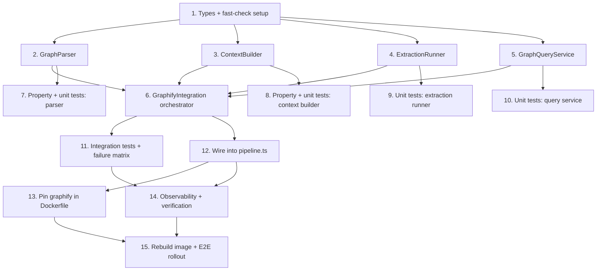

# Implementation Plan

## Overview

This plan implements the graphify integration overhaul in a new `container/src/lib/graphify/` module: shared types first, then the four independent components (GraphParser, ContextBuilder, ExtractionRunner, GraphQueryService), the orchestrator that composes them, their tests (property-based + unit + integration), the pipeline wiring that replaces `runGraphifyIndexing`, and finally observability plus full build/test verification. Components in wave 2 are independent and can be built in parallel; their tests likewise.

## Task Dependency Graph



```json
{
  "waves": [
    { "wave": 1, "tasks": ["1"] },
    { "wave": 2, "tasks": ["2", "3", "4", "5"] },
    { "wave": 3, "tasks": ["6", "7", "8", "9", "10"] },
    { "wave": 4, "tasks": ["11", "12", "13"] },
    { "wave": 5, "tasks": ["14"] },
    { "wave": 6, "tasks": ["15"] }
  ]
}
```

## Tasks

- [x] 1. Scaffold module, shared types, and test tooling
  - Create `container/src/lib/graphify/` directory and `types.ts` with `GodNode`, `GraphData`, `AffectedResult`, `ExtractionOutcome`, `DegradationReason`, `GraphifyContext`, and `GraphifyResult` interfaces from the design.
  - Add `fast-check` to `container/package.json` devDependencies for property-based tests; run `npm install` in `container/`.
  - Create `container/test/graphify/` with a shared fixtures helper (sample `graph.json` with `nodes`/`links`/`built_at_commit` and `.graphify_analysis.json` with `gods`).
  - _Requirements: 1.7, 6.4_

- [x] 2. Implement GraphParser (defensive, never-throws)
  - Add `graph-parser.ts` with `parse(graphDir): GraphData` reading `graph.json` and `.graphify_analysis.json`.
  - Derive `edgeCount` from `links.length`, `nodeCount` from `nodes.length`, node identity from `.label`, `godNodes` from sidecar `gods[]` (`{id,label,degree}`), and `builtAtCommit` from `built_at_commit`.
  - Build `nodesByFile` from each node's `source_file`. Guard every field access; return `available:false` GraphData on any missing/malformed input; catch all exceptions internally.
  - _Requirements: 1.1, 1.2, 1.3, 1.4, 1.5, 1.6, 1.7, 4.2_

- [x] 3. Implement ContextBuilder (pure, bounded, structured→string)
  - Add `context-builder.ts` with a pure `build(graphData, affected, maxChars): GraphifyContext`.
  - Assemble sections in priority order: (1) PR-scoped blast-radius summary with per-dependent `[relation]` (confidence tag optional — only if an `explain` pass was run, since `affected` omits it), (2) god nodes, (3) repo totals; implement `render()` that appends sections until `maxChars` would be exceeded, guaranteeing `length ≤ maxChars` for any positive bound including 1.
  - Add an `unavailableContext(reason)` factory returning a short valid non-empty string for degraded cases.
  - Implement `reviewNotice(): string | undefined` — a bounded one-line human-readable notice per `DegradationReason`, returning `undefined` on the happy path.
  - _Requirements: 4.4, 6.4, 7.1, 7.2, 7.3, 7.4, 11.2, 11.3, 12.1, 12.3, 12.4_

- [x] 4. Implement ExtractionRunner (headless, incremental vs full, budget-bounded)
  - Add `extraction-runner.ts` with `ensureGraph(workDir, signal, budgetMs): Promise<ExtractionOutcome>`.
  - DEFAULT (code-only, no key) → `graphify update <workDir>`. VERIFIED: `graphify extract` hard-fails (exit 1, no graph.json) on any repo with docs and no key, and has no code-only flag; `graphify update` is the headless no-LLM code-only command and succeeds with docs present. It writes in-repo to `<workDir>/graphify-out` (no `--out`), so delete any pre-existing `<workDir>/graphify-out` first (avoid updating a committed/stale/foreign graph, R3.8b); `mode` is `full` each run. The pipeline's `cleanup(workDir)` removes the in-repo output.
  - SEMANTIC OPT-IN (`GRAPHIFY_SEMANTIC_DOCS=1` AND a key) → `graphify extract <workDir> --out <outParent> --backend <b>` where `outParent = <workDir>-gfx`. VERIFIED: `extract --out <dir>` writes to `<dir>/graphify-out/`, so `graphDir = join(outParent, 'graphify-out')`. Existence-check that path for the `incremental`/`full` mode label. An opt-in without a key falls back to the code-only `update` path (never a docs-failing `extract`). The pipeline removes `<workDir>-gfx` during cleanup.
  - Run via `execa(..., { timeout: budgetMs, cancelSignal: signal, reject: false })`. Classify outcomes: exit 0 → `ok` with `mode`/`durationMs`; "no LLM API key found" stderr (semantic path only) → `missing-key` (retain any code-only graph written); timeout/abort → `timeout`; other non-zero → `unexpected-error`.
  - _Requirements: 3.1, 3.2, 3.3, 3.4, 3.5, 3.6, 3.7, 3.8, 3.8a, 3.8b, 3.9, 4.1, 9.1, 9.2, 9.3, 11.1_

- [x] 5. Implement GraphQueryService (PR-scoped, read-only, ID-based)
  - Add `query-service.ts` with `blastRadius(graphDir, changedFiles, changedSymbols, signal): Promise<AffectedResult[]>`.
  - Canonicalize paths on both sides (repo-root-relative, forward-slashed, strip leading `./`) before matching. Resolve query subjects to **unique node IDs** from `GraphData.nodesByFile[changedFile]` (NOT bare labels — they fail with "No unique node match"); use `changedSymbols` only to rank which IDs to query first; cap at top-N IDs.
  - For each node ID run `graphify affected "<id>" --depth 2 --graph <graphDir>/graph.json` (read-only) via execa; parse text lines into `dependents` capturing `[relation]` (note: `affected` output has NO confidence tag); record `matchCount`; continue batch on zero/no-unique-match or per-query failure.
  - (Optional) confidence tags are available only via `graphify explain "<id>"`; if enabled, run `explain` for the top-priority nodes only.
  - Return `[]` when no node IDs resolve (repo-level summary path in the builder). Individually time-box each query.
  - _Requirements: 2.1, 2.2, 2.3, 2.4, 2.5, 2.6, 9.4, 9.5, 10.3, 11.2_

- [x] 6. Implement GraphifyIntegration orchestrator
  - Add `index.ts` with `run(workDir, changedFiles, changedSymbols, signal, maxChars): Promise<GraphifyResult>` chaining ExtractionRunner → GraphParser → GraphQueryService → ContextBuilder.
  - Wrap the whole flow in try/catch returning a valid fallback context on any unexpected error; make graphify the authoritative blast-radius source with tree-sitter as fallback when the graph is unavailable.
  - Populate `telemetry` (counts, mode, durationMs, queriedSymbols, totalMatches, degradationReason).
  - _Requirements: 4.1, 4.2, 4.3, 4.5, 6.1, 6.2, 6.3, 8.1, 8.2_

- [x] 7. Property + unit tests for GraphParser
  - Property (fast-check): arbitrary/degenerate JSON never makes `parse` throw (Property 1).
  - Unit: fixture graph.json/sidecar → assert `edgeCount` from `links` (regression: not from `edges`), god nodes from sidecar, commit, `nodesByFile`.
  - Run `npm test` in `container/` and confirm green.
  - _Requirements: 1.1, 1.4, 1.5, 1.6, 4.2_

- [x] 8. Property + unit tests for ContextBuilder
  - Properties (fast-check): totality (non-null string), purity/idempotence, bounded output for any positive `maxChars` including 1 (Properties 2, 3, 4).
  - Unit: tight-bound truncation preserves the blast-radius summary; `unavailableContext` renders valid non-empty concatenation-safe strings for every `DegradationReason` (Property 5).
  - Unit: `reviewNotice()` returns a bounded non-empty string for each `DegradationReason` and `undefined` on success.
  - _Requirements: 4.4, 6.3, 7.1, 7.2, 7.3, 7.4, 12.1, 12.3, 12.4_

- [x] 9. Unit tests for ExtractionRunner
  - Mock `execa`: assert output goes to the out-of-repo `--out <graphDir>` and the existence-check never inspects `workDir/graphify-out`; assert a repo-committed `graphify-out/` does NOT trigger `update`.
  - Assert `update` chosen when our `graphDir/graph.json` exists and full extract otherwise; assert no key/backend on the default (code-only) path; assert `--backend` added only when `GRAPHIFY_SEMANTIC_DOCS=1` and key present.
  - Simulate "no LLM API key" stderr → `missing-key` with code-only graph retained; simulate timeout → `timeout`.
  - _Requirements: 3.1, 3.2, 3.3, 3.4, 3.7, 3.8, 3.8a, 3.8b, 4.1_

- [x] 10. Unit tests for GraphQueryService
  - Mock `execa` returning sample `affected` text → parse dependents and `matchCount`; zero-result subject continues batch; empty `changedSymbols` → no queries.
  - Unit: path canonicalization — a `changedFile` like `./pkg/x.ts` and a node `source_file` `pkg/x.ts` resolve to the same key (guards silent zero-result querying).
  - Property (fast-check): parsed dependents are a subset of fixture graph node labels (Property 6, scope monotonicity).
  - _Requirements: 2.3, 2.4, 2.5, 2.6, 9.5_

- [x] 11. Integration tests across the failure matrix
  - Test `GraphifyIntegration.run()` with mocked components for each row of the failure matrix (docs-no-key, timeout, malformed graph, unexpected error) → always returns a `GraphifyResult` whose `context.render()` is a valid string and whose `reviewNotice()` is a non-empty notice.
  - Confirm success path yields PR-scoped context, correct telemetry, and `reviewNotice() === undefined`.
  - Confirm the pipeline appends the notice to `finalReview` on degradation and adds nothing on success.
  - _Requirements: 4.1, 4.2, 4.3, 4.5, 8.1, 8.2, 12.2, 12.3, 12.5_

- [x] 12. Wire GraphifyIntegration into pipeline.ts (replace runGraphifyIndexing)
  - Replace the `runGraphifyIndexing` call site: build `const graph = await graphifyIntegration.run(workDir, blastRadius.changedFiles, blastRadius.changedSymbols, signal, MAX_GRAPH_CONTEXT_CHARS)`.
  - Append `graph.context.render()` to `containerBlastRadiusText` (map phase) and pass it as the `graphifyContext` arg to `runStage1Review` (Stage 1) — no signature changes at either injection point.
  - Just before posting, append `graph.context.reviewNotice()` (when defined) to `finalReview` in a try/catch so it never blocks posting; also append it in the outer sandbox-error `updateCheckRun` path when a `GraphifyResult` exists.
  - Add `MAX_GRAPH_CONTEXT_CHARS` and `GRAPHIFY_BUDGET_MS` (concrete value, e.g. 120000 matching today's extract timeout) to `container/src/config/constants.ts`; remove the dead `runGraphifyIndexing` function.
  - _Requirements: 6.1, 6.2, 6.3, 8.1, 8.2, 12.2, 12.4, 12.5_

- [x] 13. Pin graphify version in the container image
  - Update `container/Dockerfile` to `pip3 install --break-system-packages graphifyy==<pinned>` matching the schema the GraphParser fixtures target (currently verified against the 0.9.5 node-link schema). Do NOT run `graphify install` — the tree-sitter grammars are bundled as pip dependencies of `graphifyy`, so the pip install alone satisfies runtime (no egress needed); `graphify install` only copies the AI-assistant skill into `~/.claude` and is a needless build-failure risk here. Add `python3-dev` so native bindings can compile on Alpine/musl if no wheel is available.
  - Document the pin as the parser contract; bumping it requires re-verifying the parser fixtures.
  - Add a gate: the parser fixtures (task 7) MUST be generated from the exact pinned version's `graphify extract` output, so a version bump that changes the schema fails the parser tests rather than silently degrading in production.
  - _Requirements: 3.10, 9.1_

- [x] 14. Observability wiring and full verification
  - Emit `logger.info('graphify.complete', {...})` with node/edge/god counts, mode, durationMs, queriedSymbols, totalMatches, and degradationReason; wrap `run()` in a `startSpan('graphify.run')` tracer span with the same attributes.
  - Run `npm run build` and `npm test` in `container/`; fix any type or test failures. Clean up temporary test fixtures.
  - _Requirements: 5.1, 5.2, 5.3, 5.4, 5.5_

- [ ] 15. Container rebuild and end-to-end rollout verification
  - Rebuild the container image (Dockerfile with pinned graphify + `python3-dev`) so the new module and pin take effect; the code change is inert until the image is rebuilt and redeployed.
  - Verify graphify actually runs on the Alpine/musl image: inside the built image confirm `graphify --version` works and `graphify extract` produces a `graph.json` (the native tree-sitter bindings must import/compile). If it fails, add missing deps or switch to a glibc base (e.g. `node:20-bookworm-slim`).
  - Run one end-to-end review against a test PR: confirm logs show real edge/god-node counts (not 0), incremental vs full mode, and PR-scoped `affected` matches; confirm a docs-containing repo no longer hard-fails when a key is present.
  - Force a degradation (e.g. simulate a timeout) and confirm the posted review contains the degradation notice; confirm a clean run's posted review contains no notice.
  - _Requirements: 3.8, 5.1, 5.2, 9.2, 12.2, 12.3_

## Notes

- All commands run from `container/`: `npm install` (after task 1 adds fast-check), `npm test` (`vitest run`), `npm run build` (tsc typecheck + esbuild bundle).
- Components in wave 2 are independent and depend only on `types.ts`; build/test them in parallel.
- No changes to `buildReviewChunks` or `buildStage1SystemPrompt` signatures — only the value source at the two injection points changes.
- Per the design's R8 decision, `container/src/ast-graph.ts` `buildBlastRadius` is retained as the fallback and query-seed source; it is not removed.
- graphify persistence is in-run only (ephemeral containers); do not add a cross-review cache in this spec.
